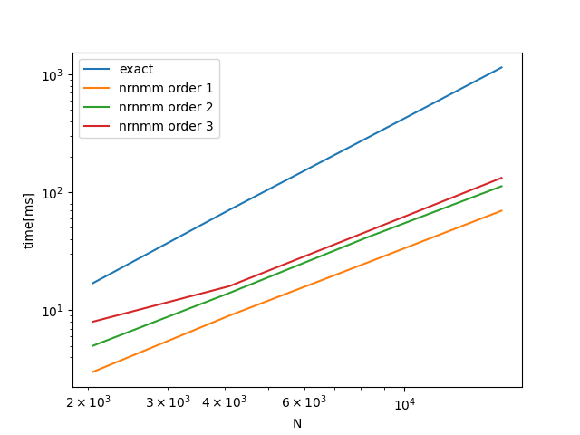
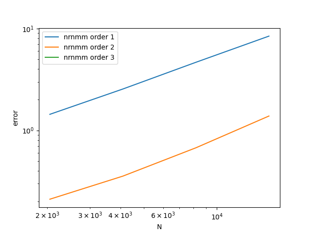

<p align="center">
  
</p>


[](https://github.com/fockl/FMMA/actions/workflows/actions.yml)

[](https://vscode.dev/github/fockl/FMMA)

[English](#fmmaenglish)

# FMMA

任意次元の任意の関数$f$について、

``` math

c_i = \sum_{j} a_i f(\bm{x}_i-\bm{y}_j) b_j

```

を高速に計算するためのライブラリ

# 使い方

```c++
FMMA<double, 3> fmma;
fmma.fn = fn;
fmma.solve_type = solve_type;
fmma.solve(y, x, c);
```

fnは任意の関数を指定できる。C++だと

```c++
auto fn = [](const std::array<double, 3>& y, const std::array<double, 3>& x){
  return (y[0]-x[0])*(y[1]-x[1]);
}
```

のように定義できる。

solve_typeは計算方法。
現在は`exact`と`nrnmm`の2通り実装

$O(n(x)) = O(n(y)) = O(N)$の時の計算量は以下の通り：

|type|computatoin cost|
|---|---|
|exact|O(N^2)|
|nrnmm|O(N\sqrt{N})|

# ベンチマーク結果

github-actions を用いたベンチマーク結果：





# FMMA(English)

FMMA is a library to calculate fastly

``` math

c_i = \sum_{j} a_i f(\bm{x}_i-\bm{y}_j) b_j

```

for arbitrary function $f$ in arbitrary dimension.

Benchmark results using github-actions are follows :


# Usage(English)

```c++
FMMA<double, 3> fmma;
fmma.fn = fn;
fmma.solve_type = solve_type;
fmma.solve(y, x, c);
```

arbitrary function can be set as fn. In C++, a definition of fn is like:

```c++
auto fn = [](const std::array<double, 3>& y, const std::array<double, 3>& x){
  return (y[0]-x[0])*(y[1]-x[1]);
}
```

solve_type is a computaion method.
`exact`, `nrnmm` are now implemented.

when $O(n(x)) = O(n(y)) = O(N)$, the computational cost are as follows:

|type|computatoin cost|
|---|---|
|exact|O(N^2)|
|nrnmm|O(N\sqrt{N})|

# Benchmark results

Benchmark results using github-actions are as follows:


