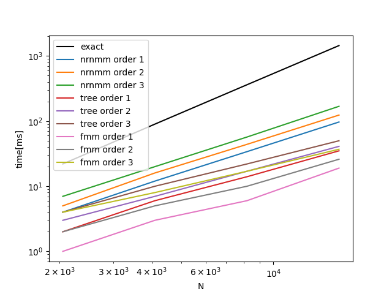
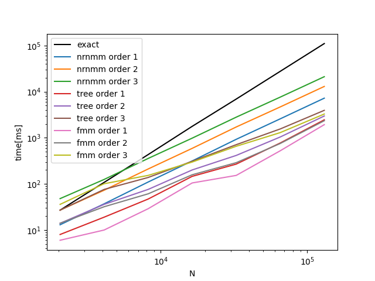
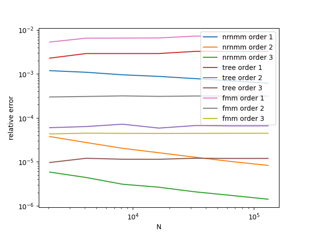

<p align="center">
  
</p>


[](https://github.com/fockl/FMMA/actions/workflows/actions.yml)

[](https://vscode.dev/github/fockl/FMMA)

[English](#fmmaenglish)

# FMMA

任意次元の変数 $x_i $, $y_j$ と任意の関数 $f$ について、

``` math

c_i = \sum_{j} w_j f(x_i, y_j)

```

を高速に計算するためのライブラリ

# インストール

cmakeを用いた場合、以下のようにしてインストール出来る
```sh
cmake -Bbuild
cmake --build build
cmake --install build
```

BLASを用いて高速化する場合は、build時に
```sh
cmake -Bbuild -DFMMA_USE_BLAS=ON
```
とする

# 使い方

```c++
fmma::FMMA<double, 3> fmma;
fmma.fn = fn;
fmma.solve_type = "exact";
fmma.solve(target, source_weight, source, ans);
```

fnは任意の関数を指定できる。C++だと

```c++
auto fn = [](const std::array<double, 3>& x, const std::array<double, 3>& y){
  return (y[0]-x[0])*(y[1]-x[1]);
}
```

のように定義できる。

solve_typeは計算方法。
現在は`exact`, `nrnmm`, `tree`, `fmm`が実装済み

$O(n(x)) = O(n(y)) = O(N)$の時の計算量は以下の通り：

|type|computatoin cost|
|---|---|
|exact|$O(N^2)$|
|nrnmm|$O(N\sqrt{N})$|
|tree|$O(N\log{N})$|
|fmm|$O(N)$|

# ベンチマーク結果

github-actions を用いたベンチマーク結果：

1次元の場合:




2次元の場合:





# 参考文献

- W. Fong and E. Darve. The black-box fast multipole method. Journal of Computational Physics, 228 (2009).

# FMMA(English)

FMMA is a library to calculate fastly

``` math

c_i = \sum_{j} w_j f(x_i, y_j)

```

for arbitrary function $f$ and variables $x_i$, $y_j$ in arbitrary dimension.

Benchmark results using github-actions are follows :

1D:


2D:


# Install(English)

You can install this library as follows if cmake is used:
```sh
cmake -Bbuild
cmake --build build
cmake --install build
```

If BLAS is required,  define an argument like:
```sh
cmake -Bbuild -DFMMA_USE_BLAS=ON
```

# Usage(English)

```c++
fmma::FMMA<double, 3> fmma;
fmma.fn = fn;
fmma.solve_type = solve_type;
fmma.solve(target, source_weight, source, ans);
```

arbitrary function can be set as fn. In C++, a definition of fn is like:

```c++
auto fn = [](const std::array<double, 3>& x, const std::array<double, 3>& y){
  return (y[0]-x[0])*(y[1]-x[1]);
}
```

solve_type is a computaion method.
`exact`, `nrnmm`, `tree`, `fmm` are now implemented.

when $O(n(x)) = O(n(y)) = O(N)$, the computational cost are as follows:

|type|computatoin cost|
|---|---|
|exact|$O(N^2)$|
|nrnmm|$O(N\sqrt{N})$|
|tree|$O(N\log{N})$|
|fmm|$O(N)$|

# Benchmark results

Benchmark results using github-actions are as follows:

1D:


2D:


# References

- W. Fong and E. Darve. The black-box fast multipole method. Journal of Computational Physics, 228 (2009).
